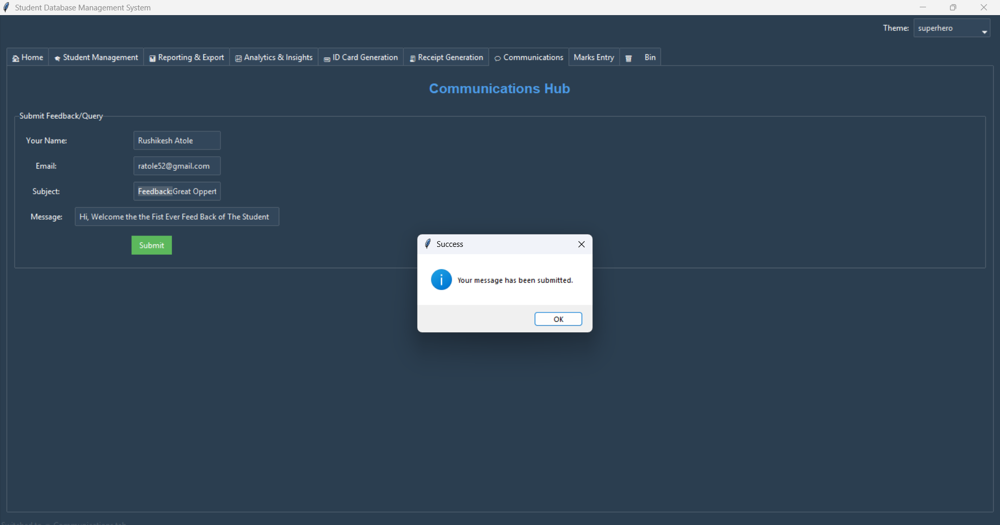

# Student Database Management System (DBMS)

A robust, scalable, and professional-grade Student Database Management System designed for educational institutions. This application delivers a modern, industry-standard solution for managing student records, analytics, reporting, and communication, with a focus on security, usability, and extensibility.

---

## Key Features

- **Professional Dashboard**: Real-time statistics and analytics.
- **Advanced Reporting**: Export to PDF/CSV, email sharing.
- **Secure Authentication**: Role-based access, password hashing.
- **Student Management**: CRUD operations, ID cards, payment receipts.
- **Visual Analytics**: Interactive charts and graphs.
- **Integrated Communication**: Feedback, queries, announcements.
- **Modern UI/UX**: Built with Tkinter/ttkbootstrap.
- **Scalable & Modular**: Clean, maintainable, and extensible codebase.
- **Comprehensive Testing**: Unit tests for all critical modules.

---

## Directory Structure

```
app/
  config.py
  main.py
  db/
  gui/
  resources/
  utils/
tests/
requirements.txt
setup.py
student_management_system.db
images/
  application/
  Charts/
```

---

## System Flow Chart

_Include your flow chart here if available:_

```

```

---

## Application Screenshots

Below are screenshots showcasing the application's interface and features:

### Application UI

| 1 | 2 | 3 | 4 |
|---|---|---|---|
|  |  |  |  |

| 5 | 6 | 7 | 8 |
|---|---|---|---|
|  |  |  |  |

| 9 | 10 | 11 | 12 |
|---|----|----|----|
|  |  |  |  |

---

## Analytics & Charts

The following charts illustrate the system's analytics and reporting capabilities:

| 1 | 2 | 3 | 4 |
|---|---|---|---|
|  |  |  |  |

| 5 | 6 | 7 | 8 |
|---|---|---|---|
|  |  |  |  |

| 9 | 10 | 11 | 12 | 13 |
|---|----|----|----|----|
|  |  |  |  |  |

---

## Getting Started

### Prerequisites

- Python 3.12+
- Install dependencies from [requirements.txt](requirements.txt)

### Installation

```sh
pip install -r requirements.txt
python app/main.py
```

### Running Tests

```sh
pytest tests/
```

---

## Deployment

- Desktop application (Tkinter/ttkbootstrap)
- Local SQLite database (`student_management_system.db`)
- All dependencies managed via `requirements.txt`

---

## License

MIT License

---

## Acknowledgements

- [Tkinter](https://docs.python.org/3/library/tkinter.html)
- [ttkbootstrap](https://ttkbootstrap.readthedocs.io/)
- [Matplotlib](https://matplotlib.org/)
- [ReportLab](https://www.reportlab.com/)

---